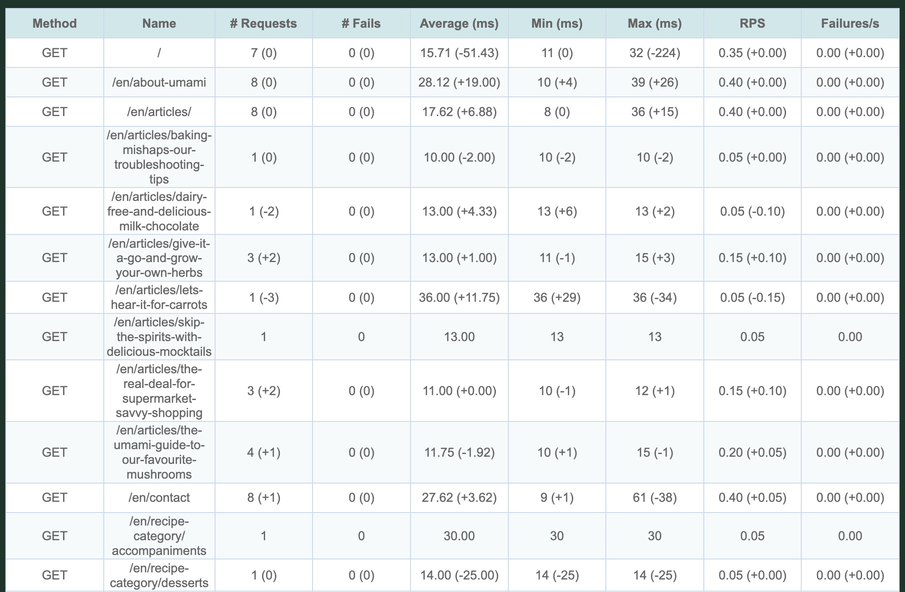

# Baseline Comparison

Goose supports baseline comparison functionality, allowing you to compare current load test results against previously saved reports to identify performance regressions and track improvements over time.

## Overview

The baseline feature enables you to:
- Compare current test results against historical data
- Generate delta reports showing performance differences
- Validate baseline files for compatibility
- Support multiple report formats (HTML, Markdown, JSON, PDF) with baseline comparisons

## Basic Usage

To use baseline comparison, you need two things:
1. A baseline report file (previously generated JSON report)
2. Current test results to compare against the baseline

### Generating a Baseline Report

First, run your load test and save the results in JSON format:

```bash
cargo run --release -- --host http://example.com/ --report-file baseline.json
```

### Running Baseline Comparison

Once you have a baseline file, you can compare subsequent test runs against it:

```bash
cargo run --release -- --host http://example.com/ --baseline-file baseline.json --report-file comparison.html
```

**Important**: You must specify `--report-file` when using `--baseline-file`. Baseline comparisons are only generated in report files (HTML, JSON, Markdown, or PDF) - they do not appear in console output.

## Command Line Options

The following command-line options control baseline functionality:

- `--baseline-file <FILENAME>`: Specifies the baseline report file to compare against
- `--report-file <FILENAME>`: Generates report files (supports .html, .htm, .md, .json, .pdf extensions)

You can combine baseline comparison with any of Goose's standard reporting options:

```bash
# Generate HTML report with baseline comparison
cargo run --release -- --host http://example.com/ --baseline-file baseline.json --report-file comparison.html

# Generate both new baseline and comparison report in one run
cargo run --release -- --host http://example.com/ --baseline-file old-baseline.json --report-file new-baseline.json --report-file comparison.html
```

## Baseline File Requirements

Baseline files must be valid JSON reports generated by Goose. The baseline validation system checks for:

- Valid JSON structure
- Required metadata fields
- Compatible metric formats
- Consistent data structures

If a baseline file fails validation, Goose will display detailed error messages explaining the issues.

## Understanding Delta Reports

When using baseline comparison, reports include delta information showing:

- **Absolute changes**: Direct numeric differences between current and baseline values
- **Percentage changes**: Relative changes as percentages
- **Performance indicators**: Visual indicators (arrows, colors) showing improvements or regressions

The following image shows what baseline comparison looks like in the Request Metrics section when running multiple Umami Example load tests:



### Interpreting Results

- **Green/positive values**: Improvements in performance metrics
- **Red/negative values**: Regressions or degraded performance  
- **Zero/neutral values**: No significant change from baseline

Common metrics compared include:
- Response times (average, minimum, maximum)
- Request rates
- Error rates
- Transaction throughput
- Status code distributions

## Implementation Notes

The baseline comparison system uses a sophisticated correlation algorithm to match current metrics with baseline metrics, ensuring accurate comparisons even when test scenarios differ slightly.

### Data Processing Pipeline

1. **Validation**: Baseline file is validated for structure and compatibility
2. **Correlation**: Current metrics are correlated with baseline metrics
3. **Delta calculation**: Differences are calculated for all matched metrics
4. **Report generation**: Results are formatted into the requested report format

### Error Handling

The system gracefully handles various edge cases:
- Missing baseline metrics (marked as "new" in reports)
- Extra baseline metrics (marked as "removed" in reports)
- Type mismatches between current and baseline data
- Corrupted or incomplete baseline files

## Best Practices

1. **Consistent test environments**: Use the same test environment and configuration for meaningful comparisons
2. **Regular baseline updates**: Update baseline files periodically to track long-term trends
3. **Version control**: Store baseline files in version control alongside your load tests
4. **Automated testing**: Integrate baseline comparisons into CI/CD pipelines for regression detection

## Troubleshooting

### Common Issues

**"Invalid baseline file"**
- Ensure the baseline file is a valid JSON report generated by Goose
- Check file permissions and accessibility
- Verify the file isn't corrupted or truncated

**"Baseline validation failed"**
- The baseline file format may be from an incompatible Goose version
- Required fields may be missing from the baseline file
- Check the detailed error messages for specific validation failures

**"No matching metrics found"**
- The current test structure differs significantly from the baseline
- Verify that you're testing the same endpoints/scenarios
- Consider updating the baseline if the test structure has intentionally changed

### Debug Information

Use Goose's debug logging to troubleshoot baseline comparison issues:

```bash
RUST_LOG=debug cargo run --release -- --host http://example.com/ --baseline-file baseline.json --report-file debug-comparison.json
```

This will provide detailed information about the baseline validation and correlation process.
