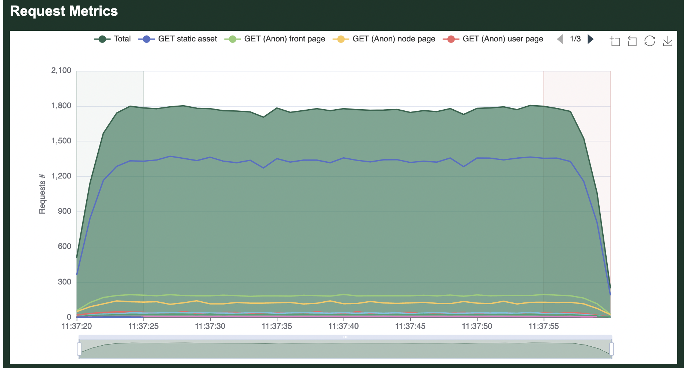

# Common Run Time Options

As seen on the previous page, Goose has a lot of run time options which can be overwhelming. The following are a few of the more common and more important options to be familiar with. In these examples we only demonstrate one option at a time, but it's generally useful to combine many options.

## Host to load test

Load test plans typically contain relative paths, and so Goose must be told which host to run the load test against in order for it to start. This allows a single load test plan to be used for testing different environments, for example "http://local.example.com", "https://qa.example.com", and "https://www.example.com".

### Host example
_Load test the https://www.example.com domain._

```bash
cargo run --release -- -H https://www.example.com
```

## How many users to simulate

By default, Goose will launch one user per available CPU core. Often you will want to simulate considerably more users than this, and this can be done by setting the "--user" run time option.

(_Alternatively, you can use [`--test-plan`](./test-plan.html) to build both simple and more complex traffic patterns that can include a varying number of users._)

### Users example
_Launch 1,000 GooseUsers._

```bash
cargo run --release -- -u 1000
```

## Controlling how long it takes Goose to launch all users

There are several ways to configure how long Goose will take to launch all configured GooseUsers. For starters, you can user either `--hatch-rate` or `--startup-time`, but not both together. Alternatively, you can use [`--test-plan`](./test-plan.html) to build both simple and more complex traffic patterns that can include varying launch rates.

### Specifying the hatch rate

By default, Goose starts one GooseUser per second. So if you configure `--users` to 10 it will take ten seconds to fully start the load test. If you set `--hatch-rate 5` then Goose will start 5 users every second, taking two seconds to start up. If you set `--hatch-rate 0.5` then Goose will start 1 user every 2 seconds, taking twenty seconds to start all 10 users.
 
(_The configured hatch rate is a best effort limit, Goose will not start users faster than this but there is no guarantee that your load test server is capable of starting users as fast as you configure._)

### Hatch rate example
_Launch one user every two seconds._

```bash
cargo run --release -- -r .5
```

### Specifying the total startup time

Alternatively, you can tell Goose how long you'd like it to take to start all GooseUsers. So, if you configure `--users` to 10 and set `--startup-time 10` it will launch 1 user every second. If you set `--startup-time 1m` it will start 1 user every 6 seconds, starting all users over one minute. And if you set `--startup-time 2s` it will launch five users per second, launching all users in two seconds.

(_The configured startup time is a best effort limit, Goose will not start users faster than this but there is no guarantee that your load test server is capable of starting users as fast as you configure._)

### Startup time example
_Launch all users in 5 seconds._

```bash
cargo run --release -- -s 5
```

## Specifying how long the load test will run

The `--run-time` option is not affected by how long Goose takes to start up. Thus, if you configure a load test with `--users 100 --startup-time 30m --run-time 5m` Goose will run for a total of 35 minutes, first ramping up for 30 minutes and then running at full load for 5 minutes. If you want Goose to exit immediately after all users start, you can set a very small run time, for example `--users 100 --hatch-rate .25 --run-time 1s`.

Alternatively, you can use [`--test-plan`](./test-plan.html) to build both simple and more complex traffic patterns and can define how long the load test runs.

A final option is to instead use the `--iterations` option to configure how many times GooseUsers will run through their assigned Scenario before exiting.

If you do not configure a run time, Goose will run until it's canceled with `ctrl-c`.

### Run time example
_Run the load test for 30 minutes._

```bash
cargo run --release -- -t 30m
```

### Iterations example
_Each GooseUser will take as long as it takes to fully run its assigned Scenario 5 times and then stop._

```bash
cargo run --release -- --iterations 5
```

## Writing An HTML-formatted Report

By default, Goose displays [text-formatted metrics](metrics.md) when a load test finishes. It can also optionally write an HTML-formatted report if you enable the `--report-file <NAME>` run-time option, where `<NAME>` is an absolute or relative path to the report file to generate. Any file that already exists at the specified path will be overwritten.

The HTML report includes some graphs that rely on the [eCharts JavaScript library](https://echarts.apache.org). The HTML report loads the library via CDN, which means that the graphs won't be loaded correctly if the CDN is not accessible.



### HTML report example
_Write an HTML-formatted report to `report.html` when the load test finishes._

```bash
cargo run --release -- --report-file report.html
```
