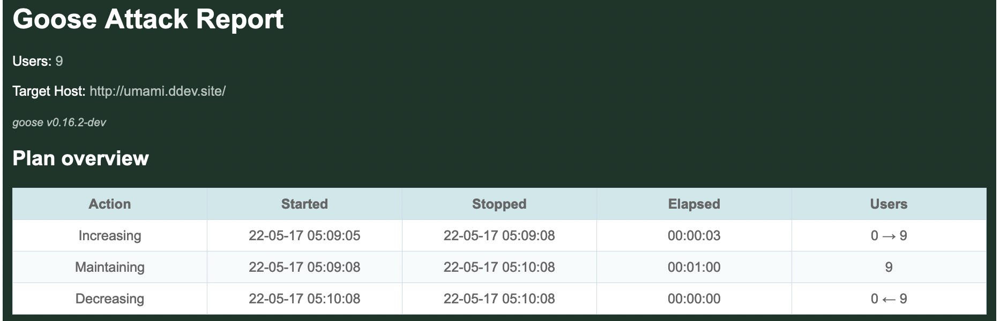
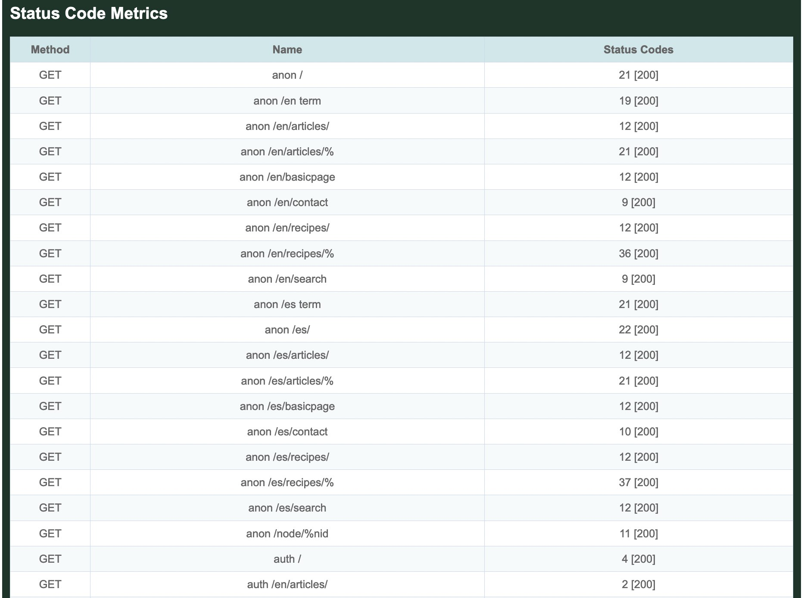
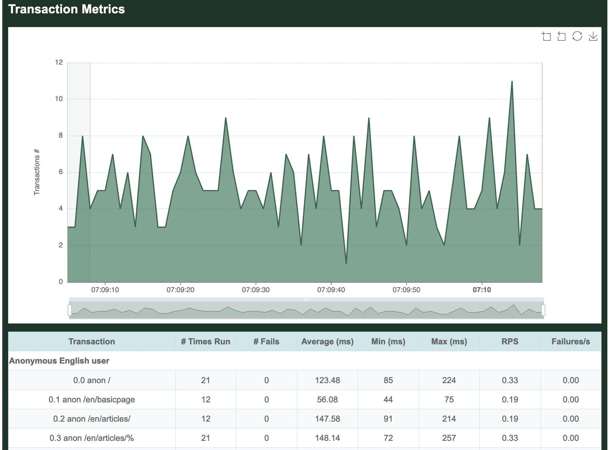
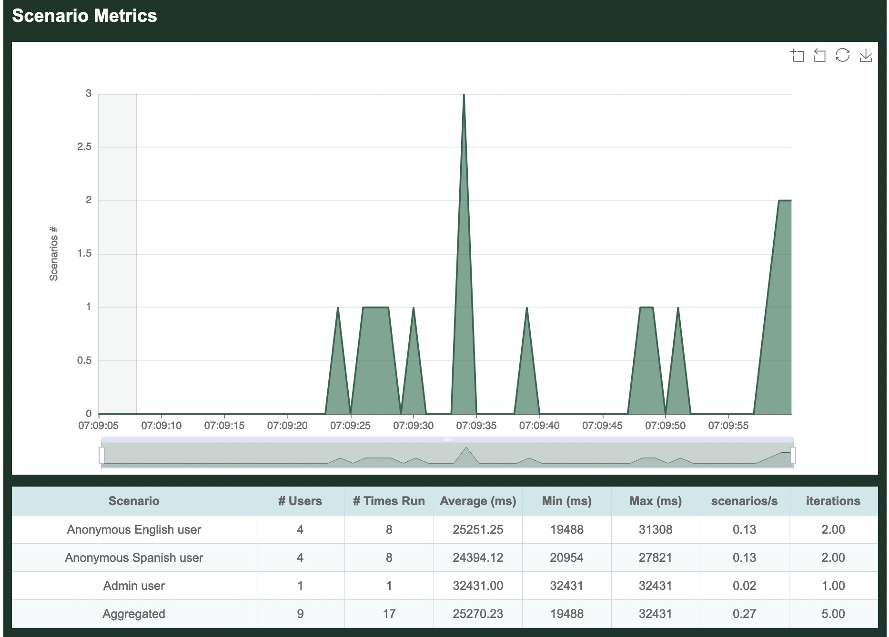

# Metrics

Here's sample output generated when running a loadtest, in this case the [Umami example](../example/umami.html) that comes with Goose.

In this case, the [Drupal Umami demo](https://www.drupal.org/docs/umami-drupal-demonstration-installation-profile) was installed in a local container. The following command was used to configure Goose and run the load test. The `-u9` tells Goose to spin up 9 users. The `-r3` option tells Goose to hatch 3 users per second. The `-t1m` option tells Goose to run the load test for 1 minute, or 60 seconds. The `--no-reset-metrics` flag tells Goose to include all metrics, instead of the default which is to flush all metrics collected during start up. And finally, the `--report-file report.html` tells Goose to generate an HTML-formatted report named `report.html` once the load test finishes.

## ASCII metrics
```bash
% cargo run --release --example umami -- --host http://umami.ddev.site/ -u9 -r3 -t1m --no-reset-metrics --report-file report.html
   Compiling goose v0.17.2 (~/goose)
    Finished release [optimized] target(s) in 11.88s
     Running `target/release/examples/umami --host 'http://umami.ddev.site/' -u9 -r3 -t1m --no-reset-metrics --report-file report.html`
05:09:05 [INFO] Output verbosity level: INFO
05:09:05 [INFO] Logfile verbosity level: WARN
05:09:05 [INFO] users = 9
05:09:05 [INFO] run_time = 60
05:09:05 [INFO] hatch_rate = 3
05:09:05 [INFO] no_reset_metrics = true
05:09:05 [INFO] report_file = report.html
05:09:05 [INFO] iterations = 0
05:09:05 [INFO] global host configured: http://umami.ddev.site/
05:09:05 [INFO] allocating transactions and scenarios with RoundRobin scheduler
05:09:05 [INFO] initializing 9 user states...
05:09:05 [INFO] Telnet controller listening on: 0.0.0.0:5116
05:09:05 [INFO] WebSocket controller listening on: 0.0.0.0:5117
05:09:05 [INFO] entering GooseAttack phase: Increase
05:09:05 [INFO] launching user 1 from Anonymous Spanish user...
05:09:05 [INFO] launching user 2 from Anonymous English user...
05:09:05 [INFO] launching user 3 from Anonymous Spanish user...
05:09:06 [INFO] launching user 4 from Anonymous English user...
05:09:06 [INFO] launching user 5 from Anonymous Spanish user...
05:09:06 [INFO] launching user 6 from Anonymous English user...
05:09:07 [INFO] launching user 7 from Admin user...
05:09:07 [INFO] launching user 8 from Anonymous Spanish user...
05:09:07 [INFO] launching user 9 from Anonymous English user...
All 9 users hatched.

05:09:08 [INFO] entering GooseAttack phase: Maintain
05:10:08 [INFO] entering GooseAttack phase: Decrease
05:10:08 [INFO] exiting user 2 from Anonymous English user...
05:10:08 [INFO] exiting user 3 from Anonymous Spanish user...
05:10:08 [INFO] exiting user 6 from Anonymous English user...
05:10:08 [INFO] exiting user 8 from Anonymous Spanish user...
05:10:08 [INFO] exiting user 4 from Anonymous English user...
05:10:08 [INFO] exiting user 7 from Admin user...
05:10:08 [INFO] exiting user 1 from Anonymous Spanish user...
05:10:08 [INFO] exiting user 9 from Anonymous English user...
05:10:08 [INFO] exiting user 5 from Anonymous Spanish user...
05:10:08 [INFO] wrote html report file to: report.html
05:10:08 [INFO] entering GooseAttack phase: Shutdown
05:10:08 [INFO] printing final metrics after 63 seconds...

 === PER SCENARIO METRICS ===
 ------------------------------------------------------------------------------
 Name                     |  # users |  # times run | scenarios/s | iterations
 ------------------------------------------------------------------------------
 1: Anonymous English u.. |        4 |            8 |        0.13 |       2.00
 2: Anonymous Spanish u.. |        4 |            8 |        0.13 |       2.00
 3: Admin user            |        1 |            1 |        0.02 |       1.00
 -------------------------+----------+--------------+-------------+------------
 Aggregated               |        9 |           17 |        0.27 |       1.89
 ------------------------------------------------------------------------------
 Name                     |    Avg (ms) |        Min |         Max |     Median
 ------------------------------------------------------------------------------
   1: Anonymous English.. |       25251 |     19,488 |      31,308 |     19,488
   2: Anonymous Spanish.. |       24394 |     20,954 |      27,821 |     20,954
   3: Admin user          |       32431 |     32,431 |      32,431 |     32,431
 -------------------------+-------------+------------+-------------+-----------
 Aggregated               |       25270 |     19,488 |      32,431 |     19,488

 === PER TRANSACTION METRICS ===
 ------------------------------------------------------------------------------
 Name                     |   # times run |        # fails |  trans/s |  fail/s
 ------------------------------------------------------------------------------
 1: Anonymous English user
   1: anon /              |            21 |         0 (0%) |     0.33 |    0.00
   2: anon /en/basicpage  |            12 |         0 (0%) |     0.19 |    0.00
   3: anon /en/articles/  |            12 |         0 (0%) |     0.19 |    0.00
   4: anon /en/articles/% |            21 |         0 (0%) |     0.33 |    0.00
   5: anon /en/recipes/   |            12 |         0 (0%) |     0.19 |    0.00
   6: anon /en/recipes/%  |            36 |         0 (0%) |     0.57 |    0.00
   7: anon /node/%nid     |            11 |         0 (0%) |     0.17 |    0.00
   8: anon /en term       |            19 |         0 (0%) |     0.30 |    0.00
   9: anon /en/search     |             9 |         0 (0%) |     0.14 |    0.00
   10: anon /en/contact   |             9 |         0 (0%) |     0.14 |    0.00
 2: Anonymous Spanish user
   1: anon /es/           |            22 |         0 (0%) |     0.35 |    0.00
   2: anon /es/basicpage  |            12 |         0 (0%) |     0.19 |    0.00
   3: anon /es/articles/  |            12 |         0 (0%) |     0.19 |    0.00
   4: anon /es/articles/% |            21 |         0 (0%) |     0.33 |    0.00
   5: anon /es/recipes/   |            12 |         0 (0%) |     0.19 |    0.00
   6: anon /es/recipes/%  |            37 |         0 (0%) |     0.59 |    0.00
   7: anon /es term       |            21 |         0 (0%) |     0.33 |    0.00
   8: anon /es/search     |            12 |         0 (0%) |     0.19 |    0.00
   9: anon /es/contact    |            10 |         0 (0%) |     0.16 |    0.00
 3: Admin user           
   1: auth /en/user/login |             1 |         0 (0%) |     0.02 |    0.00
   2: auth /              |             4 |         0 (0%) |     0.06 |    0.00
   3: auth /en/articles/  |             2 |         0 (0%) |     0.03 |    0.00
   4: auth /en/node/%/e.. |             3 |         0 (0%) |     0.05 |    0.00
 -------------------------+---------------+----------------+----------+--------
 Aggregated               |           331 |         0 (0%) |     5.25 |    0.00
 ------------------------------------------------------------------------------
 Name                     |    Avg (ms) |        Min |         Max |     Median
 ------------------------------------------------------------------------------
 1: Anonymous English user
   1: anon /              |      123.48 |         85 |         224 |        110
   2: anon /en/basicpage  |       56.08 |         44 |          75 |         50
   3: anon /en/articles/  |      147.58 |         91 |         214 |        140
   4: anon /en/articles/% |      148.14 |         72 |         257 |        160
   5: anon /en/recipes/   |      170.58 |        109 |         242 |        150
   6: anon /en/recipes/%  |       66.08 |         48 |         131 |         60
   7: anon /node/%nid     |       94.09 |         46 |         186 |         70
   8: anon /en term       |      134.37 |         52 |         194 |        130
   9: anon /en/search     |      282.33 |        190 |         339 |        270
   10: anon /en/contact   |      246.89 |        186 |         346 |        260
 2: Anonymous Spanish user
   1: anon /es/           |      141.36 |         88 |         285 |        130
   2: anon /es/basicpage  |       61.17 |         43 |          92 |         51
   3: anon /es/articles/  |      130.58 |         87 |         187 |        110
   4: anon /es/articles/% |      164.52 |         85 |         263 |        170
   5: anon /es/recipes/   |      161.25 |        108 |         274 |        120
   6: anon /es/recipes/%  |       65.24 |         47 |         107 |         61
   7: anon /es term       |      145.14 |         49 |         199 |        150
   8: anon /es/search     |      276.33 |        206 |         361 |        270
   9: anon /es/contact    |      240.20 |        204 |         297 |        230
 3: Admin user           
   1: auth /en/user/login |      262.00 |        262 |         262 |        262
   2: auth /              |      260.75 |        238 |         287 |        250
   3: auth /en/articles/  |      232.00 |        220 |         244 |        220
   4: auth /en/node/%/e.. |      745.67 |        725 |         771 |        725
 -------------------------+-------------+------------+-------------+-----------
 Aggregated               |      141.73 |         43 |         771 |        120

 === PER REQUEST METRICS ===
 ------------------------------------------------------------------------------
 Name                     |        # reqs |        # fails |    req/s |  fail/s
 ------------------------------------------------------------------------------
 GET anon /               |            21 |         0 (0%) |     0.33 |    0.00
 GET anon /en term        |            19 |         0 (0%) |     0.30 |    0.00
 GET anon /en/articles/   |            12 |         0 (0%) |     0.19 |    0.00
 GET anon /en/articles/%  |            21 |         0 (0%) |     0.33 |    0.00
 GET anon /en/basicpage   |            12 |         0 (0%) |     0.19 |    0.00
 GET anon /en/contact     |             9 |         0 (0%) |     0.14 |    0.00
 GET anon /en/recipes/    |            12 |         0 (0%) |     0.19 |    0.00
 GET anon /en/recipes/%   |            36 |         0 (0%) |     0.57 |    0.00
 GET anon /en/search      |             9 |         0 (0%) |     0.14 |    0.00
 GET anon /es term        |            21 |         0 (0%) |     0.33 |    0.00
 GET anon /es/            |            22 |         0 (0%) |     0.35 |    0.00
 GET anon /es/articles/   |            12 |         0 (0%) |     0.19 |    0.00
 GET anon /es/articles/%  |            21 |         0 (0%) |     0.33 |    0.00
 GET anon /es/basicpage   |            12 |         0 (0%) |     0.19 |    0.00
 GET anon /es/contact     |            10 |         0 (0%) |     0.16 |    0.00
 GET anon /es/recipes/    |            12 |         0 (0%) |     0.19 |    0.00
 GET anon /es/recipes/%   |            37 |         0 (0%) |     0.59 |    0.00
 GET anon /es/search      |            12 |         0 (0%) |     0.19 |    0.00
 GET anon /node/%nid      |            11 |         0 (0%) |     0.17 |    0.00
 GET auth /               |             4 |         0 (0%) |     0.06 |    0.00
 GET auth /en/articles/   |             2 |         0 (0%) |     0.03 |    0.00
 GET auth /en/node/%/edit |             6 |         0 (0%) |     0.10 |    0.00
 GET auth /en/user/login  |             1 |         0 (0%) |     0.02 |    0.00
 GET static asset         |         3,516 |         0 (0%) |    55.81 |    0.00
 POST anon /en/contact    |             9 |         0 (0%) |     0.14 |    0.00
 POST anon /en/search     |             9 |         0 (0%) |     0.14 |    0.00
 POST anon /es/contact    |            10 |         0 (0%) |     0.16 |    0.00
 POST anon /es/search     |            12 |         0 (0%) |     0.19 |    0.00
 POST auth /en/node/%/e.. |             3 |         0 (0%) |     0.05 |    0.00
 POST auth /en/user/login |             1 |         0 (0%) |     0.02 |    0.00
 -------------------------+---------------+----------------+----------+--------
 Aggregated               |         3,894 |         0 (0%) |    61.81 |    0.00
 ------------------------------------------------------------------------------
 Name                     |    Avg (ms) |        Min |         Max |     Median
 ------------------------------------------------------------------------------
 GET anon /               |       38.95 |         14 |         132 |         24
 GET anon /en term        |       95.63 |         22 |         159 |         98
 GET anon /en/articles/   |       61.67 |         16 |         139 |         42
 GET anon /en/articles/%  |       94.86 |         20 |         180 |        100
 GET anon /en/basicpage   |       25.67 |         17 |          40 |         24
 GET anon /en/contact     |       34.67 |         16 |          61 |         30
 GET anon /en/recipes/    |       59.83 |         17 |         130 |         45
 GET anon /en/recipes/%   |       27.86 |         16 |          56 |         22
 GET anon /en/search      |       54.33 |         20 |         101 |         30
 GET anon /es term        |      106.14 |         19 |         159 |        110
 GET anon /es/            |       51.41 |         18 |         179 |         29
 GET anon /es/articles/   |       53.42 |         17 |         110 |         27
 GET anon /es/articles/%  |      105.52 |         20 |         203 |        110
 GET anon /es/basicpage   |       27.25 |         18 |          55 |         22
 GET anon /es/contact     |       27.80 |         17 |          49 |         24
 GET anon /es/recipes/    |       59.08 |         18 |         165 |         26
 GET anon /es/recipes/%   |       28.65 |         16 |          61 |         26
 GET anon /es/search      |       46.42 |         17 |          99 |         25
 GET anon /node/%nid      |       52.73 |         17 |         133 |         38
 GET auth /               |      140.75 |        109 |         169 |        120
 GET auth /en/articles/   |      103.50 |         89 |         118 |         89
 GET auth /en/node/%/edit |      114.83 |         91 |         136 |        120
 GET auth /en/user/login  |       24.00 |         24 |          24 |         24
 GET static asset         |        5.11 |          2 |          38 |          5
 POST anon /en/contact    |      136.67 |         99 |         204 |        140
 POST anon /en/search     |      162.11 |        114 |         209 |        170
 POST anon /es/contact    |      137.70 |        111 |         174 |        130
 POST anon /es/search     |      164.08 |        118 |         235 |        140
 POST auth /en/node/%/e.. |      292.33 |        280 |         304 |        290
 POST auth /en/user/login |      143.00 |        143 |         143 |        143
 -------------------------+-------------+------------+-------------+-----------
 Aggregated               |       11.41 |          2 |         304 |          5
 ------------------------------------------------------------------------------
 Slowest page load within specified percentile of requests (in ms):
 ------------------------------------------------------------------------------
 Name                     |    50% |    75% |    98% |    99% |  99.9% | 99.99%
 ------------------------------------------------------------------------------
 GET anon /               |     24 |     29 |    130 |    130 |    130 |    130
 GET anon /en term        |     98 |    110 |    159 |    159 |    159 |    159
 GET anon /en/articles/   |     42 |     92 |    139 |    139 |    139 |    139
 GET anon /en/articles/%  |    100 |    120 |    180 |    180 |    180 |    180
 GET anon /en/basicpage   |     24 |     30 |     40 |     40 |     40 |     40
 GET anon /en/contact     |     30 |     46 |     61 |     61 |     61 |     61
 GET anon /en/recipes/    |     45 |     88 |    130 |    130 |    130 |    130
 GET anon /en/recipes/%   |     22 |     31 |     55 |     56 |     56 |     56
 GET anon /en/search      |     30 |     89 |    100 |    100 |    100 |    100
 GET anon /es term        |    110 |    130 |    159 |    159 |    159 |    159
 GET anon /es/            |     29 |     57 |    179 |    179 |    179 |    179
 GET anon /es/articles/   |     27 |     96 |    110 |    110 |    110 |    110
 GET anon /es/articles/%  |    110 |    140 |    200 |    200 |    200 |    200
 GET anon /es/basicpage   |     22 |     27 |     55 |     55 |     55 |     55
 GET anon /es/contact     |     24 |     35 |     49 |     49 |     49 |     49
 GET anon /es/recipes/    |     26 |    110 |    165 |    165 |    165 |    165
 GET anon /es/recipes/%   |     26 |     34 |     57 |     61 |     61 |     61
 GET anon /es/search      |     25 |     78 |     99 |     99 |     99 |     99
 GET anon /node/%nid      |     38 |     41 |    130 |    130 |    130 |    130
 GET auth /               |    120 |    160 |    169 |    169 |    169 |    169
 GET auth /en/articles/   |     89 |    118 |    118 |    118 |    118 |    118
 GET auth /en/node/%/edit |    120 |    130 |    136 |    136 |    136 |    136
 GET auth /en/user/login  |     24 |     24 |     24 |     24 |     24 |     24
 GET static asset         |      5 |      6 |     10 |     13 |     29 |     38
 POST anon /en/contact    |    140 |    150 |    200 |    200 |    200 |    200
 POST anon /en/search     |    170 |    180 |    209 |    209 |    209 |    209
 POST anon /es/contact    |    130 |    150 |    170 |    170 |    170 |    170
 POST anon /es/search     |    140 |    180 |    235 |    235 |    235 |    235
 POST auth /en/node/%/e.. |    290 |    290 |    300 |    300 |    300 |    300
 POST auth /en/user/login |    143 |    143 |    143 |    143 |    143 |    143
 -------------------------+--------+--------+--------+--------+--------+-------
 Aggregated               |      5 |      7 |    120 |    140 |    240 |    300
 ------------------------------------------------------------------------------
 Name                     |                                        Status codes 
 ------------------------------------------------------------------------------
 GET anon /               |                                            21 [200]
 GET anon /en term        |                                            19 [200]
 GET anon /en/articles/   |                                            12 [200]
 GET anon /en/articles/%  |                                            21 [200]
 GET anon /en/basicpage   |                                            12 [200]
 GET anon /en/contact     |                                             9 [200]
 GET anon /en/recipes/    |                                            12 [200]
 GET anon /en/recipes/%   |                                            36 [200]
 GET anon /en/search      |                                             9 [200]
 GET anon /es term        |                                            21 [200]
 GET anon /es/            |                                            22 [200]
 GET anon /es/articles/   |                                            12 [200]
 GET anon /es/articles/%  |                                            21 [200]
 GET anon /es/basicpage   |                                            12 [200]
 GET anon /es/contact     |                                            10 [200]
 GET anon /es/recipes/    |                                            12 [200]
 GET anon /es/recipes/%   |                                            37 [200]
 GET anon /es/search      |                                            12 [200]
 GET anon /node/%nid      |                                            11 [200]
 GET auth /               |                                             4 [200]
 GET auth /en/articles/   |                                             2 [200]
 GET auth /en/node/%/edit |                                             6 [200]
 GET auth /en/user/login  |                                             1 [200]
 GET static asset         |                                         3,516 [200]
 POST anon /en/contact    |                                             9 [200]
 POST anon /en/search     |                                             9 [200]
 POST anon /es/contact    |                                            10 [200]
 POST anon /es/search     |                                            12 [200]
 POST auth /en/node/%/e.. |                                             3 [200]
 POST auth /en/user/login |                                             1 [200]
 -------------------------+----------------------------------------------------
 Aggregated               |                                         3,894 [200] 

 === OVERVIEW ===
 ------------------------------------------------------------------------------
 Action       Started               Stopped             Elapsed    Users
 ------------------------------------------------------------------------------
 Increasing:  2022-05-17 07:09:05 - 2022-05-17 07:09:08 (00:00:03, 0 -> 9)
 Maintaining: 2022-05-17 07:09:08 - 2022-05-17 07:10:08 (00:01:00, 9)
 Decreasing:  2022-05-17 07:10:08 - 2022-05-17 07:10:08 (00:00:00, 0 <- 9)

 Target host: http://umami.ddev.site/
 goose v0.17.2
 ------------------------------------------------------------------------------
```

## HTML metrics
In addition to the above metrics displayed on the CLI, we've also told Goose to create an HTML report.

### Overview
The HTML report starts with a brief overview table, offering the same information found in the [ASCII overview](#ascii-metrics) above:


### Requests
Next the report includes a graph of all requests made during the duration of the load test. By default, the graph includes an aggregated average, as well as per-request details. It's possible to click on the request names at the top of the graph to hide/show specific requests on the graphs. In this case, the graph shows that most requests made by the load test were for static assets.

Below the graph is a table that shows per-request details, only partially included in this screenshot:


### Response times
The next graph shows the response times measured for each request made. In the following graph, it's apparent that POST requests had the slowest responses, which is logical as they are not cached. As before, it's possible to click on the request names at the top of the graph to hide/show details about specific requests.

Below the graph is a table that shows per-request details:


### Status codes
All status codes returned by the server are displayed in a table, per-request and in aggregate. In our simple test, we received only `200 OK` responses.


### Transactions
The next graph summarizes all Transactions run during the load test. One or more requests are grouped logically inside Transactions. For example, the Transaction named `0.0 anon /` includes an anonymous (not-logged-in) request for the front page, as well as requests for all static assets found on the front page.

Whereas a Request automatically fails based on the web server response code, the code that defines a Transaction must manually return an error for a Task to be considered failed. For example, the logic may be written to fail the Transaction of the html request fails, but not if one or more static asset requests fail.

This graph is also followed by a table showing details on all Transactions, partially shown here:


### Scenarios
The next graph summarizes all Scenarios run during the load test. One or more Transactions are grouped logically inside Scenarios.

For example, the Scenario named `Anonymous English user` includes the above `anon /` Transaction, the `anon /en/basicpage`, and all the rest of the Transactions requesting pages in English.

It is followed by a table, shown in entirety here because this load test only has 3 Scenarios. The `# Users` column indicates how many `GooseUser` threads were assigned to run this Scenario during the load test. The `# Times Run` column indicates how many times in aggregate all `GooseUser` threads ran completely through the Scenario. From there you can see how long on average it took a `GooseUser` thread to run through all Transactions and make all contained Requests to completely run the Scenario, as well as the minimum and maximum amount of time. Finally, `Iterations` is how many times each assigned `GooseUser` thread ran through the entire Scenario (Iterations times the # of Users will always equal the total # of times run).

As our example only ran for 60 seconds, and the `Admin user` Scenario took >30 seconds to run once, the load test only ran completely through this scenario one time, also reflected in the following table:


### Users
The final graph shows how many users were running at the various stages of the load test. As configured, Goose quickly ramped up to 9 users, then sustained that level of traffic for a minute before shutting down:


### Developer documentation
Additional details about how metrics are collected, stored, and displayed can be found [in the developer documentation](https://docs.rs/goose/*/goose/metrics/index.html).
