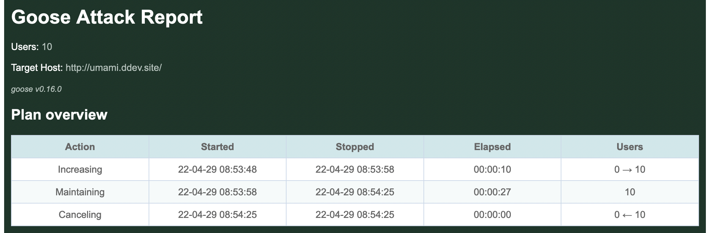
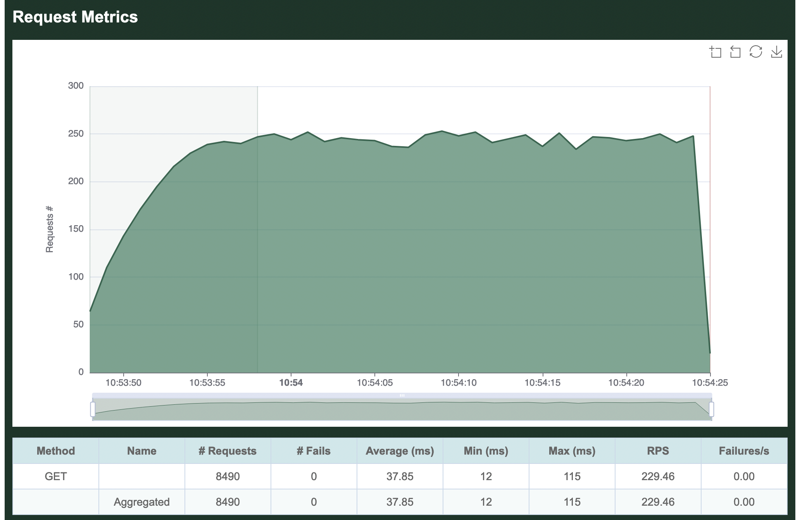
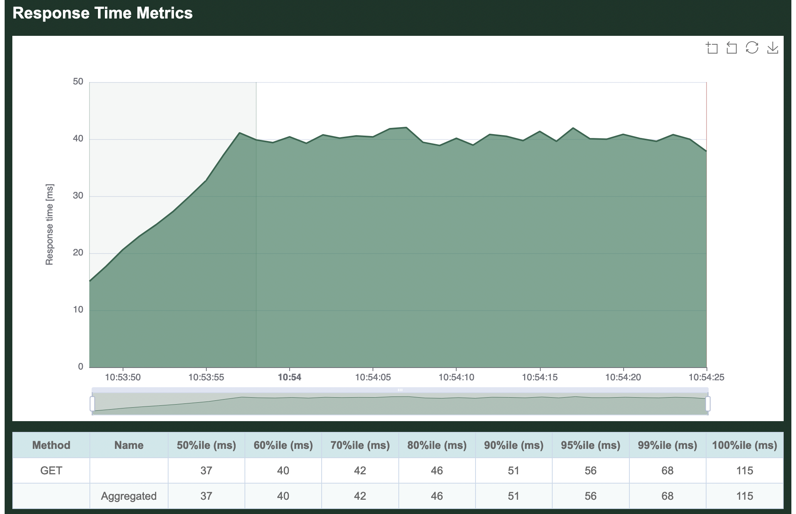
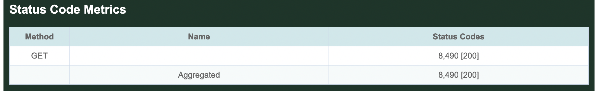
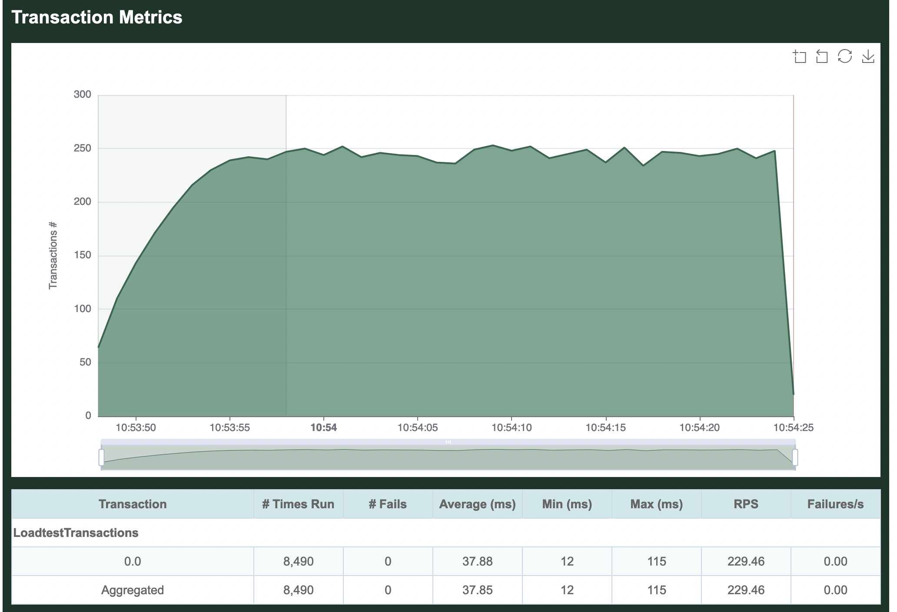
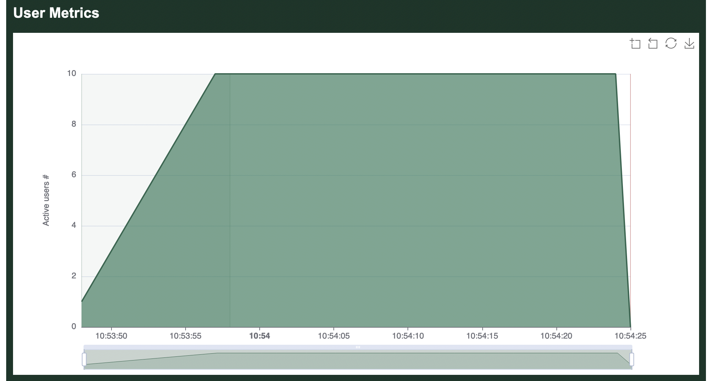

# Running A Load Test

We will use Cargo to run our example load test application. It's best to get in the habit of setting the `--release` option whenever compiling or running load tests.

```bash
$ cargo run --release
    Finished release [optimized] target(s) in 0.06s
     Running `target/release/loadtest`
07:08:43 [INFO] Output verbosity level: INFO
07:08:43 [INFO] Logfile verbosity level: WARN
07:08:43 [INFO] users defaulted to number of CPUs = 10
Error: InvalidOption { option: "--host", value: "", detail: "A host must be defined via the --host option, the GooseAttack.set_default() function, or the Scenario.set_host() function (no host defined for LoadtestTransactions)." }
```

The load test fails with an error as it hasn't been told the host you want to load test.

So, let's try again, this time passing in the `--host` flag. We will also add the `--report-file` flag, [which will generate a HTML report](common.html#writing-an-html-formatted-report), and `--no-reset-metrics` to preserve all information including the load test startup. The same information will also [be printed to the command line](metrics.md) (without graphs). After running for a few seconds, press `ctrl-c` one time to gracefully stop the load test:

```bash
% cargo run --release -- --host http://umami.ddev.site --report-file=report.html --no-reset-metrics
    Finished release [optimized] target(s) in 0.06s
     Running `target/release/loadtest --host 'http://umami.ddev.site' --report-file=report.html --no-reset-metrics`
08:53:48 [INFO] Output verbosity level: INFO
08:53:48 [INFO] Logfile verbosity level: WARN
08:53:48 [INFO] users defaulted to number of CPUs = 10
08:53:48 [INFO] no_reset_metrics = true
08:53:48 [INFO] report_file = report.html
08:53:48 [INFO] global host configured: http://umami.ddev.site
08:53:48 [INFO] allocating transactions and scenarios with RoundRobin scheduler
08:53:48 [INFO] initializing 10 user states...
08:53:48 [INFO] Telnet controller listening on: 0.0.0.0:5116
08:53:48 [INFO] WebSocket controller listening on: 0.0.0.0:5117
08:53:48 [INFO] entering GooseAttack phase: Increase
08:53:48 [INFO] launching user 1 from LoadtestTransactions...
08:53:49 [INFO] launching user 2 from LoadtestTransactions...
08:53:50 [INFO] launching user 3 from LoadtestTransactions...
08:53:51 [INFO] launching user 4 from LoadtestTransactions...
08:53:52 [INFO] launching user 5 from LoadtestTransactions...
08:53:53 [INFO] launching user 6 from LoadtestTransactions...
08:53:54 [INFO] launching user 7 from LoadtestTransactions...
08:53:55 [INFO] launching user 8 from LoadtestTransactions...
08:53:56 [INFO] launching user 9 from LoadtestTransactions...
08:53:57 [INFO] launching user 10 from LoadtestTransactions...
All 10 users hatched.

08:53:58 [INFO] entering GooseAttack phase: Maintain
^C08:54:25 [WARN] caught ctrl-c, stopping...
```

As of Goose 0.16.0, by default all `INFO` and higher level log messages are displayed on the console while the load test runs. You can disable these messages with the `-q` (`--quiet`) flag. Or, you can display low-level debug with the `-v` (`--verbose`) flag.

## HTML report

When the load tests finishes shutting down, it will display some [ASCII metrics](metrics.html#ascii-metrics) on the CLI and an HTML report will be created in the local directory named `report.html` as was configured above. The graphs and tables found in the HTML report are what are demonstrated below:



By default, Goose will hatch 1 `GooseUser` per second, up to the number of CPU cores available on the server used for load testing. In the above example, the loadtest was run from a laptop with 10 CPU cores, so it took 10 seconds to hatch all users.

By default, after all users are launched Goose will flush all metrics collected during the launching process (we used the `--no-reset-metrics` flag to disable this behavior) so the summary metrics are collected with all users running. If we'd not used `--no-reset-metrics`, before flushing the metrics they would have been displayed to the console so the data is not lost.

## Request metrics



The per-request metrics are displayed first. Our single transaction makes a `GET` request for the empty `""` path, so it shows up in the metrics as simply `GET  `. The table in this section displays the total number of requests made (8,490), the average number of requests per second (229.46), and the average number of failed requests per second (0). 

Additionally it shows the average time required to load a page (37.85 milliseconds), the minimum time to load a page (12 ms) and the maximum time to load a page (115 ms).

If our load test made multiple requests, the Aggregated line at the bottom of this section would show totals and averages of all requests together. Because we only make a single request, this row is identical to the per-request metrics.

## Response time metrics



The second section displays the average time required to load a page. The table in this section is showing the slowest page load time for a range of percentiles. In our example, in the 50% fastest page loads, the slowest page loaded in 37 ms. In the 70% fastest page loads, the slowest page loaded in 42 ms, etc. The graph, on the other hand, is displaying the average response time aggregated across all requests. 

## Status code metrics



The third section is a table showing all response codes received for each request. In this simple example, all 8,490 requests received a `200 OK` response.

## Transaction metrics



Next comes per-transaction metrics, starting with the name of our Scenario, `LoadtestTransactions`. Individual transactions in the Scenario are then listed in the order they are defined in our load test. We did not name our transaction, so it simply shows up as `0.0`. All defined transactions will be listed here, even if they did not run, so this can be useful to confirm everything in your load test is running as expected. Comparing the transaction metrics metrics collected for `0.0` to the per-request metrics collected for `GET /`, you can see that they are the same. This is because in our simple example, our single transaction only makes one request.

In real load tests, you'll most likely have multiple scenarios each with multiple transactions, and Goose will show you metrics for each along with an aggregate of them all together.

## Scenario metrics

[Per-scenario metrics](metrics.html#scenarios) follow the per-transaction metrics. This page has has not yet been updated to include a proper example of Scenario metrics.

## User metrics



Finally comes a chart showing how many users were running during the load test. You can clearly see the 10 users starting 1 per second at the start of the load test, as well as the final second when users quickly stopped.

Refer to the [examples](../example/overview.html) included with Goose for more complicated and useful load test examples.
