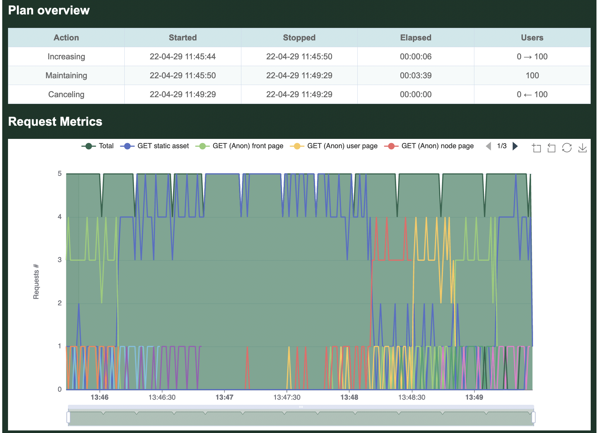

# Throttling Requests

By default, Goose will generate as much load as it can. If this is not desirable, the throttle allows optionally limiting the maximum number of requests per second made during a load test. This can be helpful to ensure consistency when running a load test from multiple different servers with different available resources.

The throttle is specified as an integer and imposes a maximum number of requests, not a minimum number of requests.

## Example

In this example, Goose will launch 100 GooseUser threads, but the throttle will prevent them from generating a combined total of more than 5 requests per second.

```bash
$ cargo run --release -- -H http://local.dev/ -u100 -r20 --throttle-requests 5
```

