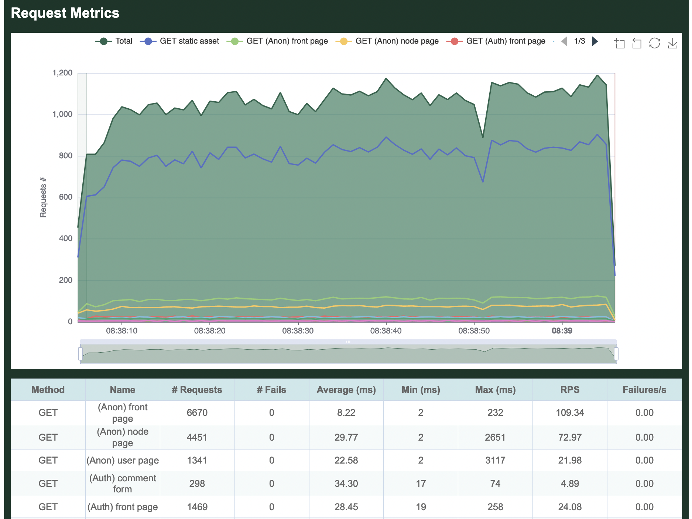

# The Goose Book

Have you ever been attacked by a goose?

## What Is Goose?

[Goose](https://docs.rs/goose) is a [Rust](https://www.rust-lang.org/) load testing tool inspired by [Locust](https://locust.io/). User behavior is defined with standard Rust code. Load tests are applications that have a dependency on the [Goose library](https://crates.io/crates/goose). Web requests are made with the [Reqwest](https://docs.rs/reqwest) HTTP Client.

## Advantages

Goose generates at least 11x as much traffic as Locust per-CPU-core, with even larger gains for more complex load tests (such as those using third-party libraries to scrape form content). While Locust requires you to manage a distributed load test simply to use multiple CPU cores on a single server, Goose leverages all available CPU cores with a single process, drastically simplifying the process for running larger load tests. Ongoing improvements to the codebase continue to bring new features and faster performance. Goose scales far better than Locust, efficiently using available resources to accomplish its goal. It also supports asynchronous processes enabling many more simultaneous processes to ramp up thousands of users from a single server, easily and consistently.

Goose’s distributed testing design is similar to Locust’s, in that it uses a one Manager to many Workers model. However, unlike Locust, you do not need to spin up a distributed load test to leverage all available cores on a single server, as a single Goose process will fully leverage all available cores. Goose distributed load tests scale near-perfectly as once started each Worker performs its load test without any direction from the Manager, and the Manager simply collects statistics from all the Workers for final reporting. In other words, one Manager controlling eight Workers on a single 8-CPU-core server generates the same amount of load as a single standalone Goose process independently leveraging all eight cores.

Goose has a number of unique [debugging and logging mechanisms](./logging/overview.html) not found in other load testing tools, simplifying the writing of load tests and the analysis of results. Goose also provides more [comprehensive metrics](./getting-started/metrics.html) with multiple simple views into the data, and makes it easy to confirm that the load test is doing what you expect it to as you scale it up or down. It exposes the algorithms used to allocate scenarios and contained transactions, giving [more granular control](./config/scheduler.html) over the order and consistency of operations, important for easily repeatable testing.

## What's Missing

At this time, the biggest missing feature of Goose is a UI for controlling and monitoring load tests, but this is a work in progress. A recently completed first step toward this goal was the addition of an [optional HTML report](./getting-started/common.html#writing-an-html-formatted-report) generated at the end of a load test.

## Brought To You By

Goose development is sponsored by [Tag1 Consulting](https://tag1.com/), led by Tag1's CEO, [Jeremy Andrews](https://foundation.rust-lang.org/posts/2021-10-26-member-spotlight-tag1/), along with many [community contributions](https://github.com/tag1consulting/goose/graphs/contributors). Tag1 is a [member of the Rust Foundation](https://www.tag1consulting.com/blog/tag1-joins-rust-foundation-first-silver-member).

## Additional Documentation

- [Developer documentation](https://docs.rs/goose/)
- [Blogs and more](https://tag1.com/goose/)
  - [Goose vs Locust and jMeter](https://www.tag1consulting.com/blog/jmeter-vs-locust-vs-goose)
  - [Real-life load testing with Goose](https://www.tag1consulting.com/blog/real-life-goose-load-testing)
  - [Gaggle: a distributed load test](https://www.tag1consulting.com/blog/show-me-how-flock-flies-working-gaggle-goose)
  - [Optimizing Goose performance](https://www.tag1consulting.com/blog/golden-goose-egg-compile-time-adventure)
